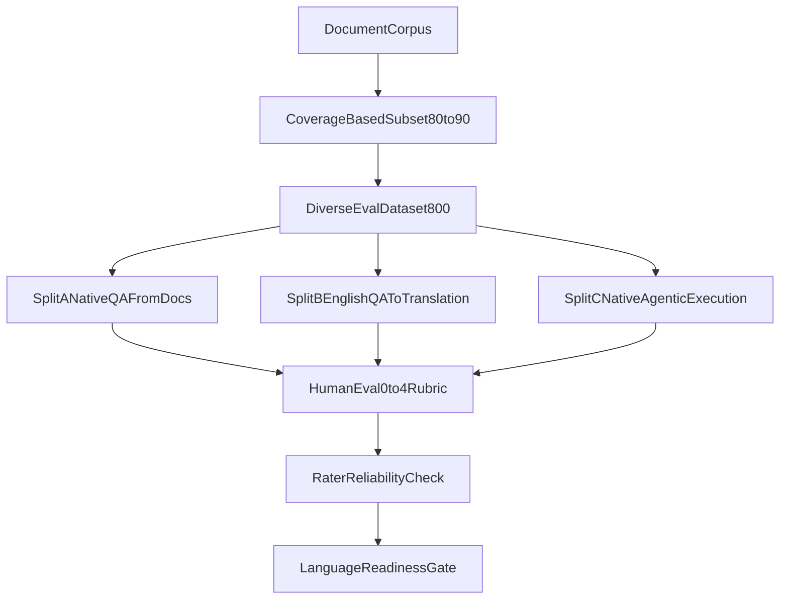

# Language Expansion Evaluation Spec

This document defines how to decide whether a new language + LLM is ready for Vistaar use.

The objective is to evaluate:
- language quality,
- factual and task quality,
- native-language agentic capability,
- moderation and safety behavior,
- persona adherence,

using **human-only scoring** with a shared 0-4 rubric.

## Why This Exists

A language can look strong on translation but still fail on tool use, retrieval quality, or persona behavior in real workflows.  
This spec separates those concerns into clear splits and combines them into one readiness decision.

## Readiness Definition

A language is considered ready only when all of the following hold:
- translation quality is strong,
- direct native-language answering is strong,
- native-language tool-calling and reasoning quality are strong,
- moderation/safety behavior is reliable,
- persona consistency is maintained.

Strong translation alone is not enough for go-live.

## Fixed Dataset Design (800 Samples)

Each language evaluation run uses **exactly 800 samples**.

### 1) Corpus-grounded set (500)
- Source: document corpus.
- Goal: cover a large share of corpus vocabulary/tokens across all documents.
- Method: coverage-driven sampling so selected cases collectively cover core domain terms.

### 2) Popular user-question set (100)
- Source: most frequent Vistaar user-question patterns/logs.
- Goal: match real production distribution of common asks.

### 3) Tool-trajectory capability set (100)
- Source: cases requiring explicit tool use and intermediate steps.
- Goal: measure tool-call quality across short, medium, and long trajectories.

### 4) Moderation and safety set (100)
- 50 from real logs (weird/unsafe/edge prompts).
- 50 authored internally to fill policy coverage gaps.
- Goal: evaluate refusal quality, safe redirection, and compliance.

## Three Evaluation Splits

All three splits are mandatory for readiness.

### Split A: Native QA From Docs
- Start from source documents.
- Create question in target language.
- LLM answers in target language.
- Humans score the answer quality in that language.
- Purpose: direct in-language comprehension + response quality.

### Split B: English QA -> LLM Translation
- Keep question and canonical answer in English.
- Ask LLM to translate final answer into target language.
- Humans score translation quality and meaning preservation.
- Purpose: isolate language transfer quality from reasoning/tool use.

### Split C: Native-Language Agentic Execution
- Input question is in target language.
- LLM gets tools/data sources and executes full workflow.
- Tool calls and final answer are evaluated by humans.
- Purpose: true native-language agentic readiness.

## Human Evaluation Rubric (0-4)

Every scored metric is human-rated from 0 to 4.

- `0`: unusable / fully incorrect
- `1`: major failures
- `2`: mixed quality, not reliable
- `3`: good with minor issues
- `4`: excellent, production quality

## Metrics To Score

### Shared quality metrics
- `factual_grounding`
- `task_completeness`
- `actionability`
- `agentic_process_quality` (query reformulation, tool selection, tool sequencing)
- `persona_adherence`
- `safety_compliance`

### Language quality metrics
- `lexical_diversity`
- `cohesion_coherence`
- `completeness_long_context`
- `grammatical_accuracy`
- `named_entity_handling` (translation vs transliteration correctness)

## Critical-Fail Signals

Any severe issue in these areas should trigger fail-review:
- unsafe or policy-violating output,
- fabricated facts in high-risk contexts,
- major named-entity corruption that changes meaning,
- invalid tool use causing materially wrong answers.

## Evaluator Assignment Plan

Base setup per language:
- Evaluator 1 scores all 800 samples.
- Evaluator 2 scores all 800 samples.
- Evaluator 3 scores a 200-sample overlap subset.

If more evaluators are available:
- split the 800 primary workload among them,
- keep overlap slices for reliability and calibration,
- retain adjudication capacity for disagreements.

### 200-sample overlap guidance
- Stratify overlap across all dataset buckets:
  - corpus-grounded,
  - popular user questions,
  - tool trajectories,
  - moderation/safety.
- Ensure overlap also spans all three splits (A/B/C).
- Include hard cases (long context, multi-tool, ambiguous intent).

## Reliability and Adjudication

- Track inter-rater reliability (for example, weighted kappa / ICC).
- Trigger adjudication when raters differ by 2 or more points on critical metrics.
- Use adjudicated score as final for disputed cases.
- Block final readiness decision if reliability is below agreed threshold.

## Confidence (Approximate)

With 800 samples and 2 full evaluators (plus 200-sample third-rater overlap):
- expected 95% confidence half-width for overall mean is typically around `+/-0.05` to `+/-0.07`,
- with strong overlap quality and adjudication, effective uncertainty is often near `+/-0.05`.

This usually supports detection of meaningful deltas around `0.10` to `0.15` on the 0-4 scale.

## Readiness Decision Output

Report separately:
- Split A score,
- Split B score,
- Split C score,
- overall combined score,
- critical-fail rate,
- reliability status.

Final status should be one of:
- `Ready`
- `Ready with constraints`
- `Not ready`

## Recommended Execution Cadence

1. Pilot calibration subset (small shared set).
2. Rubric alignment and wording fixes.
3. Full 800-sample run.
4. Adjudication and reliability check.
5. Readiness decision and action plan.
6. Re-validation after model/prompt/toolchain changes.

## Flow Overview

