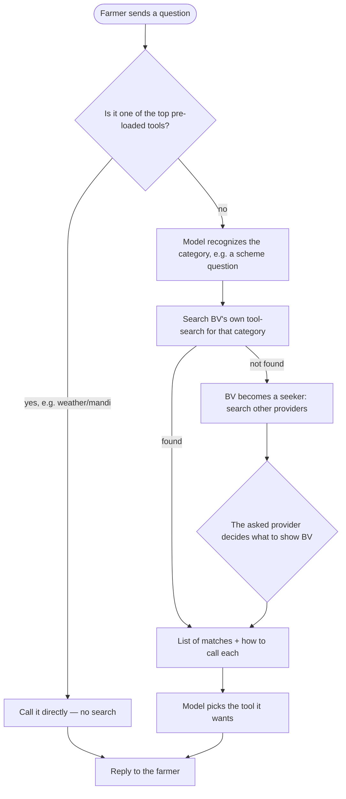
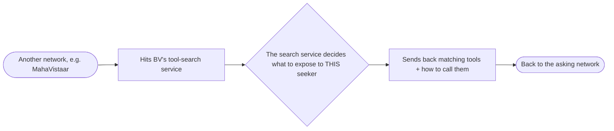

# Extended Approach: A Network-Wide Tool-Search Service

Builds directly on top of the scheme-sync approach: the review-and-approval pipeline,
the scheme database, and the versioning all stay exactly as they are. Only one part
changes. Instead of a Redis layer that gets updated each time a scheme doc changes, this
extends the same idea to *all* tool calls and makes it queryable. A tool-call search
layer is added so that anyone can query it to find out what tool calls (and sources of
information) a provider has. An LLM receiving a query just searches this layer to figure
out which tool call to use — the initial system prompt only needs to explain how to use
the search and the model's general capabilities, not enumerate everything up front.

## Summary

The model always has a small, general awareness of the broad categories of things it can
help with — weather, mandi prices, government schemes, advisory content. When a question
comes in, the model recognizes which category it belongs to, constructs a search query
for the tool-call search layer, and gets back both a list of what matched and
instructions on how to call each one. This tool-search isn't a private mechanism hidden
inside Bharat Vistaar (BV) — it's built as part of the network. Any outside seeker
(another network, like MahaVistaar) can query it the exact same way BV's own model does
internally, and the search service itself decides what to expose to whom. BV uses the
same service in reverse too: when it needs a tool it doesn't have locally, it becomes a
seeker itself and searches other providers' tool-search services the same way.

## The search service is part of the network, not private to BV

This is the same piece of infrastructure serving two directions:

- **Inbound** — another network (say, MahaVistaar) sends a search request in, asking
  what tools BV has for some category. BV's tool-search service decides what to show
  that specific asker and replies with a list of matches plus how to call each one.
- **Outbound** — BV's own model uses the identical service internally, for its own tool
  selection, before ever going out to another network.

It's one service, one search interface — not two separate systems that happen to look
similar.

## When BV itself is the seeker

- BV needs a tool for something (a scheme, or any other capability).
- It checks internally first — its own tool-search, over its own tools.
- If nothing useful turns up locally, BV becomes a seeker and sends the same kind of
  search request out to other providers on the network — not just one, potentially
  several.
- Each provider's own tool-search service decides what to show BV specifically, and
  replies with its own list of matches plus instructions on how to call each one.
- BV picks whichever tool it actually wants, based on the lists and instructions it got
  back, and calls it.

## The most-used tools stay pre-loaded; everything else is searched

Not every tool goes through this search step. The 2–3 tools BV uses most often (today,
that's things like weather and mandi prices) are pre-loaded directly into every prompt,
so using them is instant — no search needed, because they're used often enough that
keeping them immediately ready is worth it. Everything else — including the full,
growing scheme catalog — goes through the search step described above, and is only
pulled in when a question actually needs it.

## Why not just the plain sync approach

Even while just considering schemes, the full scheme list gets pasted into the AI's
instructions on every single message, whether relevant or not, and that only gets worse
as more schemes get added. This is not scalable across more tools and more providers.

## Flow — BV answering its own farmer

## Flow — someone else querying BV

## Changes on top of the plain sync approach

These steps use schemes as the worked example, since that's what the original approach
was about — but the same pattern (pre-loaded top tools, category recognition, search
within a category, network exposure decided by the service itself) applies to every
category, not just schemes.

- Keep the front half exactly as it is: PDF upload → human review → approval → scheme
  facts saved into the same shared database → version number goes up.
- This method is supplemented with the same tagging approach used in Amul — this helps
  expand to more methods of search and filtering if required in the future.
- Replace the "copy everything into Redis" job with a search service. Where the plain
  approach has a background job that copies the whole scheme list into Redis so it can
  be pasted into text, this approach puts a small search service in front of the same
  database — one that can look up a scheme by name, code, or free-text description, the
  same way the existing scheme-document search already works. This is the same service
  every other searchable category sits behind.
- **Redis replacement — undecided**: whether to do the search inside Redis or a Qdrant
  service, the same way it's done for memory, so it's easy to query across networks.
  Instead of "hold a full copy of the list so it can be pasted into every prompt," it
  becomes "help this search service answer lookups quickly" — an index to query, not a
  block of text to paste.
- The top few most-used tools skip the search step entirely — pre-loaded into every
  prompt, because they're called often enough that instant access is worth it.
  Everything else, schemes included, goes through category recognition, then a search
  within that category.
- The scheme search checks BV's own data first. If nothing matches, BV becomes a seeker
  and sends the same kind of search request out to other providers (a Maharashtra-only
  scheme asked on the national chatbot, or the other way around).
- Whichever provider is asked decides what to share, itself. Each provider's own
  tool-search service checks who's asking and what that specific asker is allowed to
  see, then sends back a short list of matching schemes — not a single decided answer —
  along with what actions are available for each (e.g. "you can check live status of
  this one").
- BV gets the answer back in the same shape either way — a list of matches plus how to
  call each one — whether it came from its own data or another provider's. It picks the
  right one and replies to the farmer.
- The same search service works in reverse. Any other network can query BV's tool-search
  the same way BV queries others — and it's BV's own search service that decides, per
  asker, what to expose. There's no separate gate bolted on afterward; the decision is
  part of the service.

## Timelines

Undecided.

## Extension

The one thing to add on top of this would be using memory to help preload the tools
according to each person's usage patterns.
